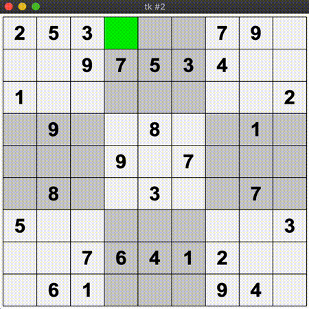
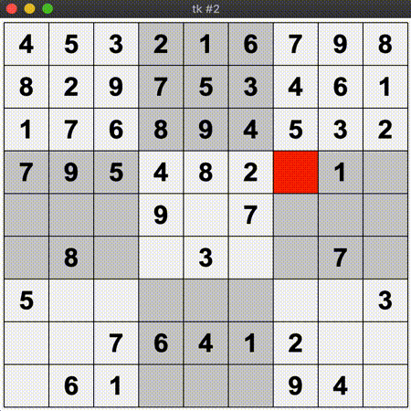

# sudokusolver
###### by faydyn
### Python Programm to solve Sudokus via Backtracking

___
#### Tkinter Visualization

#### Finishes quick in the end :)

_a bit low fps due to .gif-format_
___
### Dev Plans
#### Latest Update: 2019-12-01
###### Recent
* __Display Sudokus as picture__
    * sudoku.txt to numpy array to picture
    * function to map picture to corresponding txt for sudoku choice
* add more sudokus
* Tkinter: fast or graphical solution - decider
###### Far Future
* Flask Web App
* Language Superclass / languages as subclasses
* ~py2exec to run on PC as standalone
___
### Needs Fixing

___
### Releases
##### v0.1 (2019-11-28)
* __Backtracking Algorithm__ implemented working (without optimizations)
* __Parser__ for .txt-Files to read multiple Sudokus (separated by some alphabetical char (title))
* __os-package__ absolute pathes working  (should be working in every folder on every system)
* __Tkinter__ GUI (simple, to choose sudoku to solve)

##### v0.2 (2019-11-30)
* __Tkinter__ graphical solution
* Board resizeable and offsetable (not  dynamically)

#### v1.0 (2019-12-01)
* rudimentary things work properly afaik