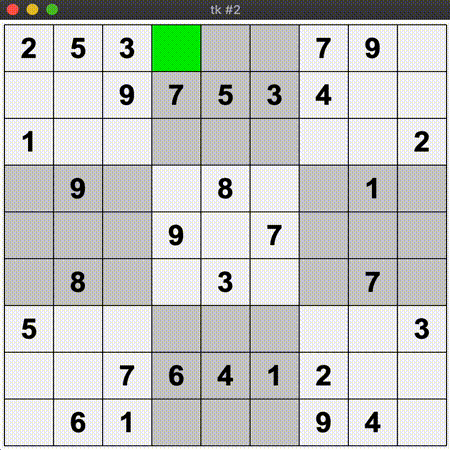
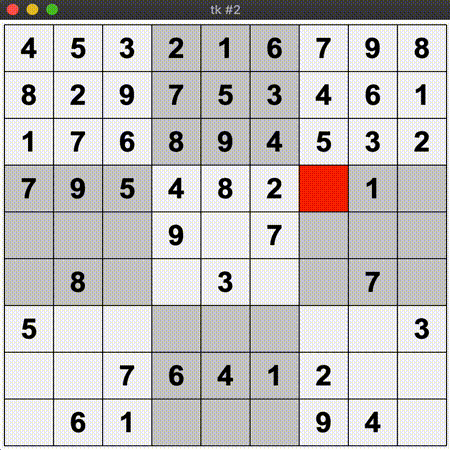

# sudokusolver
Python Programm to solve any Sudoku via Backtracking
###### by faydyn
___
#### Starting the Algorithm

#### Finishes quick in the end :)

_a bit low fps due to .gif-format_
___
### WiP 
##### Latest Update: 2019-11-30
* Implement UI: fast or graphical solution - decider
* Language Superclass / languages as subclasses
* ~py2exec to run on PC as standalone
___
### Needs Fixing
* "spaced" sudokus to non-spaced (script), __BECAUSE__:
    * weird offset on blinking tile 
    * not enough delay async numbers and color tile
___
### Releases
##### v0.1 (2019-11-28)
* __Backtracking Algorithm__ implemented working (without optimizations)
* __Parser__ for .txt-Files to read multiple Sudokus (separated by some alphabetical char (title))
* __os-package__ absolute pathes working  ($\Rightarrow$ should be working in every folder on every system)
* __Tkinter__ GUI (simple, to choose sudoku to solve)

##### v0.2 (2019-11-30)
* __Tkinter__ graphical solution
* Board resizeable and offsetable (not  dynamically)
